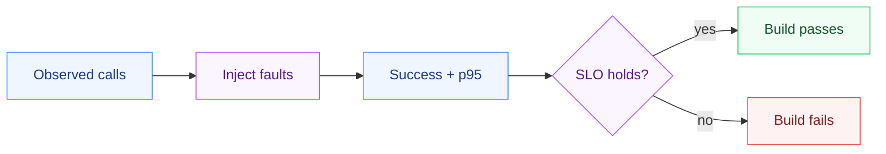

# ChaosMeshLite

**Resilience testing as a pass/fail CI gate.**

Services claim to be resilient, but nobody actually tests their failure modes until an outage proves otherwise. ChaosMeshLite injects controlled faults - added latency, periodic errors - into a stream of observed calls and then **asserts your SLOs still hold**. If they don't, the experiment fails the build. Same engine in **Python, C#, and Java**.

## The problem

"We're resilient" is a claim, not a test. Chaos engineering (Netflix's Chaos Monkey) fixes that - but most teams run it as a scary manual drill, not something enforced continuously. ChaosMeshLite makes a chaos experiment a **deterministic, repeatable, CI-runnable assertion**.

## What it does

- **Fault injection**: added latency and periodic error injection (deterministic schedule, not RNG - so experiments are reproducible).
- **Experiment run**: computes success rate and p95 latency under fault.
- **SLO evaluation**: pass/fail against `min_success_rate` and `max_p95_latency_ms`, with human-readable breach reasons.

## Use it (Python)

```python
from chaos import FaultPolicy, Slo, run_experiment, evaluate_slo

result = run_experiment(observed_latencies, FaultPolicy(added_latency_ms=500))
outcome = evaluate_slo(result, Slo(min_success_rate=0.99, max_p95_latency_ms=200))
assert outcome.passed, outcome.breaches   # fails CI if the SLO breaks under chaos
```

Or from the command line (a file of latencies; exits 1 if the SLO breaks):

```bash
cd python
python src/cli.py latencies.txt --added-latency 300 --fail-every 20 --min-success 0.99 --max-p95 250
```

## Three languages, one behavior

| Language | Tests | Run |
|----------|:-----:|-----|
| Python | 8 | `cd python && pytest -q` |
| C# (.NET 10) | 8 | `cd csharp && dotnet test` |
| Java (17+) | 8 | `cd java && mvn test` |

Faults follow a deterministic schedule, so all three produce identical results - no flaky chaos.

## Known limitations / next

- Fault model is latency + error-rate; resource starvation and dependency-outage faults are natural additions.
- Operates on recorded latencies; a live proxy that injects faults into real traffic is the production form.
- Deterministic-only; a seeded-probabilistic mode would model bursty failures.

## Design notes

- **[DESIGN.md](DESIGN.md)** - why deterministic faults (not RNG) make it a real CI
  gate, the outcome-stream vs live-injection trade-off, and the non-goals.

## How it works



## Layout

```
chaos-mesh-lite/
├── python/   reference implementation + pytest suite
├── csharp/   .NET 10 port - Chaos.cs + tests
├── java/     JDK 17+ port (Maven)
└── DESIGN.md the fault model, the SLO-gate contract, the non-goals
```


Part of [parag-labs](https://github.com/parag-labs) - small, focused tools for building AI systems you can trust.
